# Mustang CI/CD Evolution: Repository Structure and Versioning Strategy

## Table of Contents

- [1. Executive Summary](#1-executive-summary)
- [2. How Versioning and Deployment Work Today](#2-how-versioning-and-deployment-work-today)
  - [2.1 How app artifact versions are produced](#21-how-app-artifact-versions-are-produced)
  - [2.2 How infra POM files store those versions](#22-how-infra-pom-files-store-those-versions)
  - [2.3 How deployment builds resolve and use artifacts](#23-how-deployment-builds-resolve-and-use-artifacts)
  - [2.4 Current development and release flow](#24-current-development-and-release-flow)
  - [2.5 Current pain points](#25-current-pain-points)
- [3. Decision Axes](#3-decision-axes)
- [4. Axis 1 - Where Code Resides](#4-axis-1---where-code-resides)
  - [4.1 Separated Repos (current)](#41-separated-repos-current)
  - [4.2 Plain Monorepo](#42-plain-monorepo)
  - [4.3 Subtree Monorepo](#43-subtree-monorepo)
- [5. Axis 2 - How Deployment Versions Are Referenced](#5-axis-2---how-deployment-versions-are-referenced)
  - [5.1 Hash Reference (current)](#51-hash-reference-current)
  - [5.2 Explicit Version Reference](#52-explicit-version-reference)
  - [5.3 Inverted Dependency Manifest](#53-inverted-dependency-manifest)
  - [5.4 Deployment Parameter with Artifactory (Artifact Id)](#54-deployment-parameter-with-artifactory-artifact-id)
  - [5.5 Deployment Parameter - Build on Demand (no Artifactory)](#55-deployment-parameter---build-on-demand-no-artifactory)
- [6. The Hash Reference Timing Problem (Monorepo/Subtree)](#6-the-hash-reference-timing-problem-monoreposubtree)
- [7. Combined Approaches](#7-combined-approaches)
  - [Approach 1: Separated Repos + Hash Reference (current baseline)](#approach-1-separated-repos--hash-reference-current-baseline)
  - [Approach 2: Plain Monorepo + Hash Reference](#approach-2-plain-monorepo--hash-reference)
  - [Approach 3: Subtree Monorepo + Hash Reference](#approach-3-subtree-monorepo--hash-reference)
  - [Approach 4: Separated Repos + Inverted Dependency Manifest](#approach-4-separated-repos--inverted-dependency-manifest)
  - [Approach 5: Separated Repos + Artifact Id Deployment Parameter](#approach-5-separated-repos--artifact-id-deployment-parameter)
  - [Approach 6: Separated Repos + Build on Demand (no Artifactory)](#approach-6-separated-repos--build-on-demand-no-artifactory)
  - [Approach 7: Plain Monorepo + Build on Demand](#approach-7-plain-monorepo--build-on-demand)
  - [Approach 8: Plain Monorepo + Artifact Id Deployment Parameter](#approach-8-plain-monorepo--artifact-id-deployment-parameter)
  - [Approach 9: Plain Monorepo + Inverted Dependency Manifest](#approach-9-plain-monorepo--inverted-dependency-manifest)
- [8. Comparison Matrix](#8-comparison-matrix)
- [9. Key Questions Answered](#9-key-questions-answered)
- [10. Recommendation](#10-recommendation)
- [11. Immediate Actions without changes to architecture](#11-immediate-actions-without-changes-to-architecture)
- [12. Suggested Tickets Plan](#12-suggested-tickets-plan)

---

## 1. Executive Summary

The Mustang platform is split across four tightly-coupled repositories. Many changes require updates to several repos, forcing multiple PRs, coordinated sequencing, and strict dependency timing. This creates windows where one repo is updated while another is not, leading to pipeline failures and non-atomic deployments.

This document evaluates how to improve our ability to deliver atomic changes across services. It separates the decision into two independent axes - **where code resides** and **how deployment versions are referenced** - then evaluates each combined approach with interaction diagrams, required changes, and operational trade-offs.

### Repositories in scope

| Current Repository | Monorepo Prefix | Scope |
| :--- | :--- | :--- |
| `MetOffice/mustang-service-applications` | `app/` | Java and Python Mustang applications |
| `MetOffice/mustang-buckets` | `buckets/` | Bucket definitions and IaC |
| `MetOffice/service-hub-object-service` | `object-service/` | Object service IaC and deployment config |
| `MetOffice/service-hub-feature-service` | `feature-service/` | Feature service IaC and deployment config |

### Benefits we are evaluating

1. Ability to deliver atomic changes across services.
2. Simplified dependency management and reduced cross-repo drift.
3. Unified CI/CD and consistent release processes.
4. Easier refactoring of shared logic and registries.
5. More efficient developer workflow (fewer coordinated PRs).

### Note on previous direction

Since the last meeting, while trying to fix the approval step, it became clear that the previously preferred subtree direction (combined with the current hash-reference model) depends on too many workarounds and does not provide enough confidence. This document resets the decision space.

---

## 2. How Versioning and Deployment Work Today

Understanding the current system is essential before evaluating alternatives. This section describes the end-to-end flow from app artifact production through to deployment.

### 2.1 How app artifact versions are produced

**Release versions** use a 7-character commit SHA:

- `.github/scripts/java-release.sh` sets `-Drevision=$SHORT_BASELINE_SHA -Dchangelist=""`
- Published artifact versions look like: `76d64ae`, `bfb0f60`, `4df9854`

**Development SNAPSHOT versions** use branch-based naming:

- `app/java/applications/pom.xml` defines `<revision>leopard</revision>` and `<changelist>-SNAPSHOT</changelist>`
- `.github/scripts/java-snapshot-build.sh` overrides changelist to `-${BRANCH_NAME}-SNAPSHOT`
- Published artifact versions look like: `leopard-feature-abc-SNAPSHOT`

### 2.2 How infra POM files store those versions

Each infra service has an artefacts POM that pins app module versions as properties:

| Infra Service | Version Properties |
| :--- | :--- |
| `buckets/artefacts/pom.xml` | `bucket-events-publisher.version`, `registry-manager.version` |
| `feature-service/artefacts/pom.xml` | `feature-service.version`, `api-authoriser.version`, `registry-manager.version` |
| `object-service/artefacts/pom.xml` | `object-service.version`, `api-authoriser.version`, `registry-manager.version` |

Each dependency uses property indirection (e.g. `<version>${feature-service.version}</version>`), so changing the property changes what artifact version Maven resolves.

### 2.3 How deployment builds resolve and use artifacts

**Step 1 - CodeBuild runs `mvn package`:**

Deployment buildspecs (`buckets/build/buildspec.yaml`, `feature-service/build/buildspec.yaml`, `object-service/build/buildspec.yaml`) run Maven against the infra artefacts POM. Maven resolves app dependencies using the pinned version properties.

**Step 2 - Artifactory repository selection:**

Maven settings (`*/build/config/settings.xml`) include both `libs-release` (SHA versions) and `libs-snapshot` (SNAPSHOT versions) repositories.

**Step 3 - Stable file names via `stripVersion`:**

The `maven-dependency-plugin` copies resolved jars with `stripVersion=true`, producing stable filenames like `feature-service.jar`, `api-authoriser.jar`, `registry-manager.jar`. This is why IaC templates can reference constant artifact paths regardless of version.

**Step 4 - CloudFormation packaging and deployment:**

Buildspecs run `aws cloudformation package`, producing packaged templates (e.g. `packaged_feature_service_template.yaml`). Deployment pipeline stages consume these templates. IaC templates point to stable local artifact paths (e.g. `CodeUri: ../../artefacts/feature-service.jar`).

### 2.4 Current development and release flow

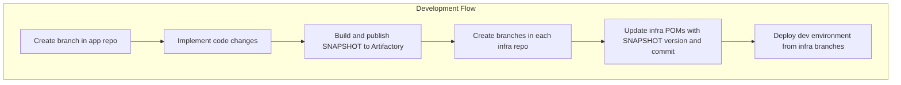
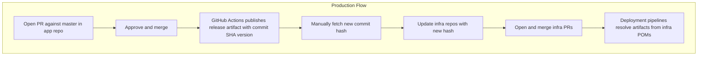

### 2.5 Current pain points

1. **Lack of atomicity**: An app change can merge to master while matching infra updates in one or more repos are delayed or forgotten.
2. **Repetitive version sync**: The most frequent infra commits have no business value - they only update a version reference.
3. **Multi-repo coordination overhead**: Each change requires creating dedicated branches in up to three infra repos, increasing context switching.
4. **Race condition risk**: When two developers merge app PRs close together, one may unknowingly overwrite the other's infra POM version during conflict resolution, causing the infra to point at an older version.
5. **Traceability friction**: Understanding "what is deployed" requires cross-referencing infra POM properties, pipeline history, and Artifactory metadata.

---

## 3. Decision Axes

We separate the decision into two independent axes. Each can be chosen independently, though some combinations work better than others.

### Axis 1 - Where code resides

| Option | Summary |
| :--- | :--- |
| **Separated Repos** | Current model. App and infra in independent repositories. |
| **Plain Monorepo** | All code merged into one repository. One branch, one PR surface. |
| **Subtree Monorepo** | Coordination repo with linked subtree histories of existing repos. |

### Axis 2 - How deployment versions are referenced

| Option | Summary |
| :--- | :--- |
| **A) Hash Reference** | Infra POMs store commit-hash-based artifact versions (current). |
| **B) Explicit Version** | Semantic or named versions replace hash-style identifiers. |
| **C) Inverted Manifest** | App publishes deployment manifest; infra consumes it from Artifactory. |
| **D) Deploy Parameter (with Artifactory)** | Pipeline receives Artifact Id or SHA at runtime; resolves from Artifactory. |
| **E) Deploy Parameter (build on demand)** | Pipeline receives SHA, checks out source, builds artifacts at deploy time. |

**Terminology - Artifact Id:** Throughout this document, "Artifact Id" refers to the identifier of a published Artifactory package. In Mustang's case, release Artifact Ids use the 7-character commit SHA of the app release (e.g. `feature-service:76d64ae`). Development Artifact Ids use branch-based SNAPSHOT identifiers (e.g. `feature-service:leopard-feature-abc-SNAPSHOT`). The Artifact Id is not a separate concept from the current SHA-based versioning — it is the same value, but consumed as a deployment-time parameter rather than a committed file reference.

**Key structural constraint:** Combinations of monorepo or subtree code storage (Axis 1 options 2–3) with hash-based version references (Axis 2 option A) face a timing problem: the release hash that infra should reference is only finalized *after* merge, but infra files containing that reference are part of the same merge. This creates a requirement for post-merge mutation, which undermines the atomicity benefit. This is analyzed in detail in Section 6.

---

## 4. Axis 1 - Where Code Resides

### 4.1 Separated Repos (current)

App and infra stay in separate repositories. Coordination happens through release contracts and version references - currently, infra POM files pin specific app artifact versions, and a sync script updates those references after each app release.

**Why it remains practical:** Zero migration risk. Existing operational model, permissions, and pipelines are already understood. Incremental improvements can be adopted without restructuring.

**Limitations:** Requires multiple PRs for coupled app+infra changes. Understanding what is currently deployed requires looking across infra POM files, pipeline execution logs, and Artifactory - there is no single source of truth for deployment state. Context switching between repos adds friction.

### 4.2 Plain Monorepo

All app and infra code lives in one repository with one master branch and one PR surface.

**Why it is attractive:** Maximum review-level atomicity - one PR can include app code, infra templates, build logic, and deployment updates together. Simplest Git mental model. Unified visibility and audit trail.

**Why it is difficult now:** Current release model expects infra to reference released artifact identities. In an atomic merge, the release hash that infra should reference is only finalized after the release build, which happens after merge. This creates a timing paradox requiring post-merge mutation logic, described in point 6.

**Migration impact:** Largest migration. Requires repository-history consolidation, CI/CD redesign with path-filtered pipelines, branch protection redesign, and team process changes.

### 4.3 Subtree Monorepo

A coordination monorepo that keeps linked histories of existing repos using `git subtree`. Developers work in one umbrella repository but push synchronized history back to source repos.

**Why it is attractive:** Promises atomic development workflow while maintaining compatibility with existing standalone repos and deployment pipelines.

**Why it is difficult now:** Introduces extra branch choreography, possible subtree sync steps if subtree repo changed, and release ordering constraints. If someone merges a PR directly to a subtree repo instead of through the monorepo, divergence occurs and requires subtree sync steps. Combined with current hash propagation, which causes the same timing paradox requiring post-merge mutation logic, this became hard to reason about with confidence during recent investigation.

**Migration impact:** Lower than plain monorepo for repository history, but high for operational complexity. Harder long-term maintenance cost in subtree syncing, conflict handling, and release ordering safeguards.

---

## 5. Axis 2 - How Deployment Versions Are Referenced

### 5.1 Hash Reference (current)

Infra POM properties store commit-hash-based artifact versions. A sync script updates those values when app modules change. Deployment builds resolve artifacts using those pinned versions.

**Strengths:** Already implemented. Each release is immutably tied to a specific commit. Per-module version properties preserve blast-radius control (one module can be updated without moving others). Multiple app PRs can be merged close together without conflicts because each produces a unique commit SHA - there is no shared version counter or file that two merges would race to update.

**Weaknesses:** Generates frequent infra-only commits with no business value (the only change in the commit is a hash string in a POM property). Requires updating infra repos after every app change. Becomes structurally problematic in monorepo/subtree atomic flows (see Section 6).

### 5.2 Explicit Version Reference

Replace hash-style identifiers with semantic or named versions (e.g. `2.4.1`).

**Note:** We recently migrated *away* from explicit versioning to commit-hash-based versions because concurrent PR merges could both attempt to modify `master` with version bumps, causing workflow failures.

**Strengths:** Human-readable. Policy-friendly for change approvals and audit trails. Clear release ordering without lookup.

**Weaknesses:** Adds version governance overhead. If implemented with commits back to master, the same concurrency and merge contention issues that drove the move to hash-based versions will return.

### 5.3 Inverted Dependency Manifest

The app side publishes a deployment manifest contract (artifact versions, template references, checksums) to Artifactory. Infra pipelines discover and consume that manifest at deploy time instead of managing scattered version references.

**Strengths:** Strongest app-to-deploy contract. Eliminates the repetitive infra-only commits that exist solely to update version hash strings in POM files. Supports granular per-module versions. Clean rollback by redeploying a previous manifest bundle.

**Weaknesses:** Requires manifest schema design, publication/discovery logic, integrity checks, and retention governance. Local development needs explicit override behavior. Medium-to-high implementation complexity.

### 5.4 Deployment Parameter with Artifactory (Artifact Id)

Deployment pipeline receives explicit Artifact Id inputs at runtime and resolves artifacts directly from Artifactory. Version choice moves from committed infra files to deployment-time intent.

**Strengths:** Similar outcome to manifest inversion but simpler. Works with current release pipeline. Supports non-master branches for dev deployments by referencing snapshot. No need for commit+branch dual input if Artifact Id is used. Fastest path to improved confidence.

**Weaknesses:** If implemented as a single global SHA input, blast-radius control is reduced. Requires clear deployment metadata recording for traceability.

**Blast-radius note:** Current model has per-module versions, so one module can change without forcing all modules to move together. The recommended mitigation is to use module-level Artifact Id inputs rather than one global SHA.

### 5.5 Deployment Parameter - Build on Demand (no Artifactory)

Deploy pipeline receives a source identity (SHA), checks out source, builds required modules, then deploys from that fresh build output. Removes Artifactory dependency for internal modules.

**Strengths:** Clean "deploy this SHA" model. Eliminates snapshot artifact drift risk. Deploy is tied to explicit source SHA.

**Weaknesses:** Deploy pipelines become heavier and slower due to compile/package work at deploy time. Requires reproducible builds for rollback of historic SHAs. Infra pipelines need broader tooling and repo access.

---

## 6. The Hash Reference Timing Problem (Monorepo/Subtree)

This is the key structural issue that affects any monorepo or subtree approach combined with the current hash-reference model.

**How it works today (separated repos):**
1. App release artifact is produced from latest master commit.
2. Infra repos are updated *afterward* to that exact released hash.
3. Hash-to-artifact mapping is clear and linear.

**Why it breaks with monorepo/subtree atomic merge:**
1. App and infra changes are merged together in one atomic commit.
2. The release hash that infra should reference is only finalized *after* the release build runs.
3. But infra files that should contain that reference are part of the same atomic change set.
4. This requires post-merge mutation logic (a script that patches the hash after release), which re-introduces the same confidence risks and race conditions that the atomic approach was meant to solve.

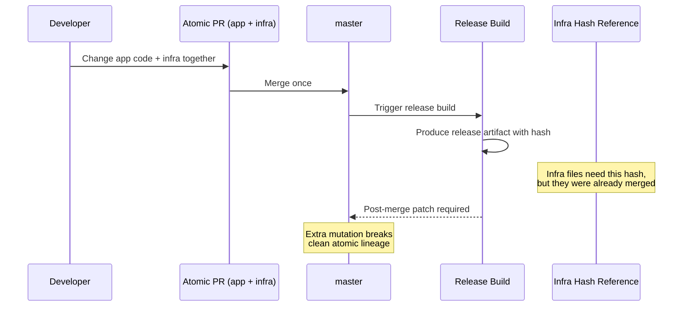

**Implication:** Monorepo or subtree approaches need a different versioning strategy (not hash reference) to deliver their full atomicity benefit.

---

## 7. Combined Approaches

Each section below evaluates a specific combination of code storage + versioning strategy, with an interaction diagram, required changes, and trade-offs.

---

### Approach 1: Separated Repos + Hash Reference (current baseline)

**What it is:** The existing model. App release automation publishes artifacts, sync automation updates infra POM hash-based references, and deployment pipelines resolve those references during build/package stages.

#### Interaction diagram

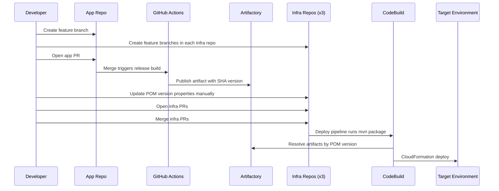

#### What changes are needed

No structural changes - this is the current model. Incremental improvements include:
- Better automation in the sync script (`app/java/applications/pom-version-sync/sync-module-versions.sh`)
- Cross-repo PR linking automation
- Improved deployment metadata recording

#### Trade-offs

| Dimension | Assessment |
| :--- | :--- |
| Atomicity | Low - app and infra changes are separate PRs |
| Migration effort | None |
| Rollback | Requires infra POM rollback + coordinated redeploy |
| Blast-radius control | Strong - per-module version properties |
| Parallel development | Good, but cross-repo sync creates pressure |
| Reversibility | N/A (baseline) |

#### Development workflow

Developer creates branches in app and infra repos separately. SNAPSHOT artifacts are published from the app branch. Infra POM properties are manually updated to reference the SNAPSHOT version on the infra branch. Dev environment is deployed from the infra branch.

#### Residual limitations

- Coupled infra or app+infra changes (e.g. new object service) still require multiple PRs across repos.
- No single source of truth for "what is deployed where" — requires cross-referencing POM files, pipeline history, and Artifactory.
- Cross-repo coordination remains manual and error-prone under parallel development.

---

### Approach 2: Plain Monorepo + Hash Reference

**What it is:** All repos merged into one. Still uses released artifact hash references for deployment. Intended to gain atomic PR review.

**Key problem:** Directly exposed to the hash-reference timing problem (Section 6). The release hash is finalized only after the release build, but infra files that reference it are part of the same atomic merge.

#### Interaction diagram

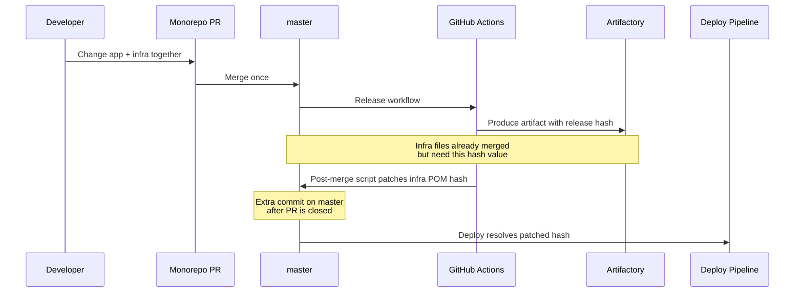

#### What changes are needed

**Repository and history:**
- Merge all four repositories into one (full history merge or selective squash)
- Archive/freeze original repositories

**CI/CD:**
- Rewrite all pipeline triggers with path-filtered monorepo workflows
- Redesign release triggers to avoid full-repo execution
- Implement post-merge hash injection automation
- Replace repository-scoped CodeBuild source assumptions

**Versioning:**
- Maintain hash-based versioning but add post-release mutation step
- Handle race conditions when two PRs merge close together

**Files primarily affected:**
- `.github/workflows/*.yml` (complete rewrite)
- `*/build/buildspec.yaml` (source path updates)
- `*/artefacts/pom.xml` (post-merge automation target)
- `*/deploy/templates/**/*.yaml` (pipeline source updates)

#### Trade-offs

| Dimension | Assessment |
| :--- | :--- |
| Atomicity | Medium-high - PR is atomic, but hash reference requires post-merge mutation |
| Migration effort | Very high |
| Rollback | Complicated - reference mutation and merge history intertwined |
| Blast-radius control | Preserved (per-module properties remain) |
| Parallel development | PR review is good, but release serialization returns at merge time |
| Reversibility | difficult - reverting monorepo migration is difficult, but doable |

#### Development workflow

Developer creates branch in monorepo with app+infra changes together. SNAPSHOT artifacts are published from the branch. Infra POM properties on the branch reference the SNAPSHOT version for dev deployment.

#### Residual limitations

- Post-merge hash mutation undermines the atomicity that motivated the monorepo migration.
- Race conditions persist under concurrent merges — two merges close together can conflict on the post-merge patch step.
- High upfront migration cost before any value is delivered.

---

### Approach 3: Subtree Monorepo + Hash Reference

**What it is:** A meta-repo manages coordinated changes via git subtree while pushing history back to linked source repos. Uses current hash-based versioning.

**Key problem:** Also exposed to the hash-reference timing problem (Section 6). Additionally, subtree sync ordering, approval flows, and release-identity materialization create compounding operational complexity. This is why confidence dropped during latest investigation.

#### Interaction diagram

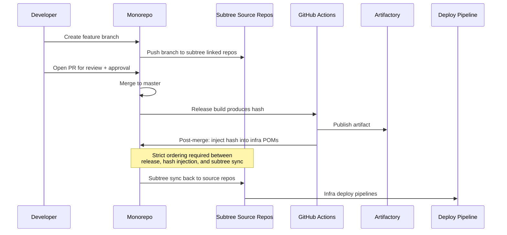

#### What changes are needed

**Tooling:**
- Build/maintain subtree orchestration tool (e.g. `monogit`)
- Create subtree sync scripts with conflict detection
- Implement post-merge hash injection with subtree awareness

**CI/CD:**
- Path-filtered workflows that trigger subtree-aware builds
- Release ordering guards to prevent race conditions
- Pre-merge parity safeguards (which serialize merges under concurrent development)

**Process:**
- Strict branch discipline - all PRs should go through monorepo, rather to subtree repos
- Subtree sync verification in CI

**Files primarily affected:**
- `.github/workflows/*.yml` (subtree-aware rewrite)
- `monogit.sh` / subtree tooling scripts
- `*/artefacts/pom.xml` (post-merge automation target)
- `scripts/subtree-push-and-verify.sh`

#### Trade-offs

| Dimension | Assessment |
| :--- | :--- |
| Atomicity | Medium-high - atomic PR review, but hash timing and subtree sync add complexity |
| Migration effort | High (operational complexity, ongoing maintenance) |
| Rollback | Operationally noisy - requires subtree lineage mapping to find correct commit |
| Blast-radius control | Preserved |
| Parallel development | Weak - subtree sync ordering fragments concurrent workflows |
| Reversibility | Moderate - can return to separate repos,  operational unwind by reverting git commits |

#### Development workflow

Developer creates branch in monorepo with app+infra changes. Subtree sync pushes the app branch to the source repo, triggering SNAPSHOT publication. Infra POM on the monorepo branch references the SNAPSHOT version for dev deployment.

#### Residual limitations

- Post-merge mutation and subtree sync ordering fragment the workflow and reduce confidence.
- Direct pushes to subtree repos cause divergence requiring manual repair.
- Highest ongoing maintenance burden of all approaches.

---

### Approach 4: Separated Repos + Inverted Dependency Manifest

**What it is:** App release publishes both artifact outputs and a deployment manifest contract to Artifactory. Infra pipelines discover and consume that manifest instead of managing version references in POM files.

#### Interaction diagram

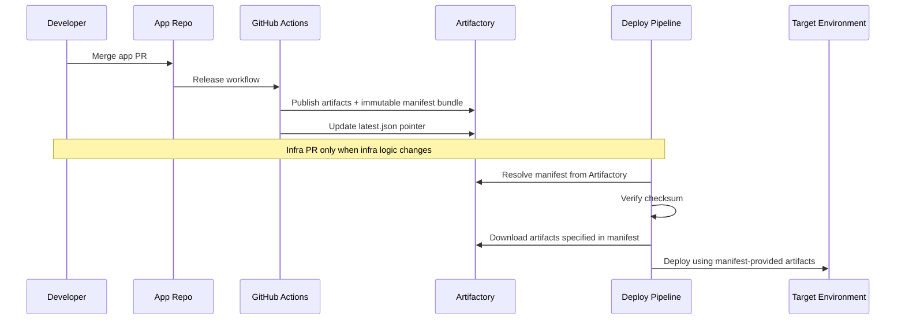

#### What changes are needed

**App repository:**
- Add manifest generation and publication in release workflows
- Define manifest schema: service, environment, source branch/commit, artifact coordinates, checksums, timestamp
- Add branch-pointer updates (`latest.json`) for development workflows
- Deprecate cross-repo version synchronization flow

**Infra repositories:**
- Add resolve-manifest stage in each pipeline (dev, CI, production)
- Switch deploy stages to manifest-provided template and parameter values
- Replace current Maven-based artifact resolution in infra buildspecs (`*/build/buildspec.yaml`) with manifest-driven artifact download - instead of infra builds running `mvn package` to resolve versioned dependencies from Artifactory, the pipeline would download pre-built artifacts specified in the manifest bundle
- Add checksum verification gates before deploy

**Operational:**
- Define Artifactory pathing and retention policy for manifests
- Define rollback playbook based on manifest version pinning
- Build local override mechanism for development manifest resolution

**Files primarily affected:**
- `.github/workflows/*.yml` (add manifest publication)
- `.github/scripts/java-release.sh` (add manifest generation step)
- `*/build/buildspec.yaml` (replace artifact resolution with manifest consumption)
- `*/deploy/templates/**/*.yaml` (pipeline parameter plumbing)
- New: manifest schema definition and discovery logic

#### Trade-offs

| Dimension | Assessment |
| :--- | :--- |
| Atomicity | Medium - manifest carries app + deployment intent together, but the other changes (ex. object service creation) require mulitple PRs |
| Migration effort | Medium-high |
| Rollback | Strong - redeploy previous immutable manifest bundle |
| Blast-radius control | Strong - manifest contains per-module versions |
| Parallel development | Good - independent manifests per release |
| Reversibility | Acceptable - retire manifest consumption, return to hash sync |

#### Development workflow

Developer publishes a development manifest from the app branch (pointing to SNAPSHOT artifacts). Dev infra deployment resolves the branch manifest from Artifactory. No infra POM changes needed for dev testing of app-only changes.

#### Residual limitations

- Coupled infra or app+infra changes (e.g. new object service) still require multiple PRs across repos.
- Manifest schema must support development/branch variants alongside production manifests.
- Medium-high implementation effort before the first service is migrated.

---

### Approach 5: Separated Repos + Artifact Id Deployment Parameter

**What it is:** Deployments are triggered with explicit Artifact Id inputs. The pipeline resolves artifacts directly from Artifactory at runtime. Version choice moves from committed infra file mutation to deployment-time intent.

#### Interaction diagram

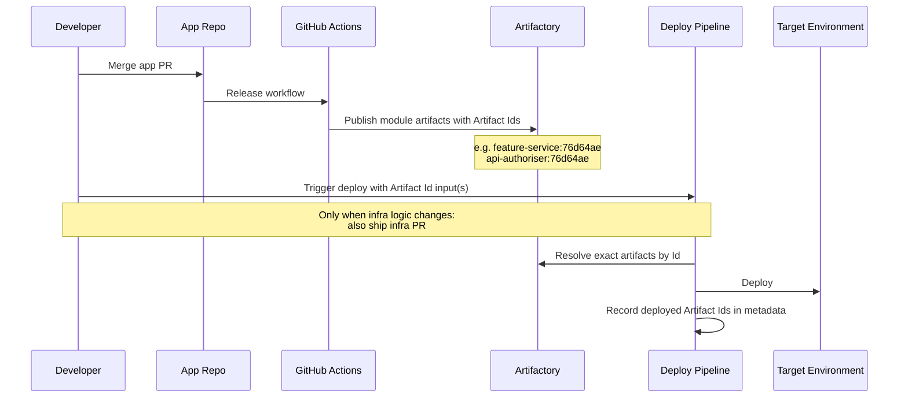

#### What changes are needed

**Deployment pipeline contracts:**
- Add `ARTIFACT_ID` input parameters per module to deployment workflows
- Wire parameters into CodeBuild environment variables
- Example inputs: `FEATURE_SERVICE_VERSION`, `API_AUTHORISER_VERSION`, `REGISTRY_MANAGER_VERSION`

**Infra buildspecs** (`*/build/buildspec.yaml`):
- Replace hardcoded POM version resolution with parameter-driven artifact resolution
- Resolve artifacts from Artifactory using input Artifact Id values
- Keep `stripVersion=true` behavior so downstream paths remain stable

**Deployment templates** (`*/deploy/templates/**/*.yaml`):
- Add parameter definitions for Artifact Id inputs in pipeline CloudFormation templates
- Pass parameters through pipeline stages to CodeBuild actions

**Deployment metadata:**
- Record deployed Artifact Ids per environment in pipeline metadata, CloudFormation stack tags/outputs, or SSM parameters
- Enables "what is deployed where" queries without cross-referencing POM files

**Deprecation path:**
- Keep existing hash-sync as fallback during transition
- Retire sync workflow per service after stability is confirmed

**Files primarily affected:**
- `.github/workflows/sync-module-versions.yml` (eventual deprecation)
- `app/java/applications/pom-version-sync/sync-module-versions.sh` (eventual deprecation)
- `*/build/buildspec.yaml` (parameterize artifact resolution)
- `*/deploy/templates/nested/dev-*-pipeline.yaml` (add parameter plumbing)
- `*/deploy/templates/**/*.yaml` (pipeline parameter definitions)

**Note on number of parameters:** Each service currently uses 2-3 app modules (e.g. feature-service uses `feature-service`, `api-authoriser`, `registry-manager`). In practice, all modules in a single app release share the same commit SHA version, so a typical deployment only needs one version input per service. Per-module overrides are available when needed (e.g. hotfix to one module only) but are the exception, not the norm.

#### Trade-offs

| Dimension | Assessment |
| :--- | :--- |
| Atomicity | Medium - app + deploy intent linked through explicit Artifact Id, but the other changes (ex. object service creation) require mulitple PRs |
| Migration effort | Low-medium |
| Rollback | Clean - redeploy previous known-good Artifact Id set |
| Blast-radius control | Strong with per-module inputs; medium if using single global SHA |
| Parallel development | Strong - independent deployments select their own inputs |
| Reversibility | High - disable parameter mode, fall back to hash sync |

#### Development workflow

Developer publishes SNAPSHOT from app branch. Triggers dev deployment pipeline with the SNAPSHOT Artifact Id (e.g. `feature-service:leopard-feature-abc-SNAPSHOT`). No infra POM changes or infra branch coordination needed for dev testing of app-only changes.

#### Residual limitations

- Coupled infra or app+infra changes (e.g. new object service) still require multiple PRs across repos.
- Developers must know which Artifact Id to pass — mitigated by automation that surfaces the latest published Id after each build.

---

### Approach 6: Separated Repos + Build on Demand (no Artifactory)

**What it is:** Deploy pipeline receives an app commit SHA, checks out app source at that exact SHA, builds required modules at deploy time, then packages and deploys. Removes Artifactory dependency for internal modules.

#### Interaction diagram

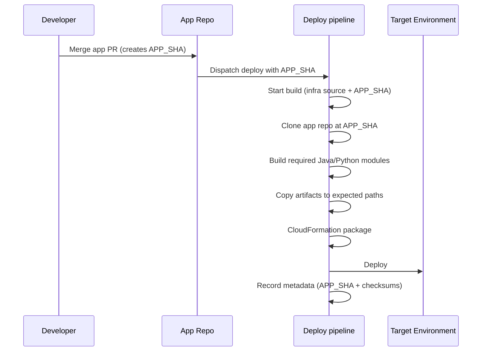

#### What changes are needed

**CI/CD contract:**
- Add deploy parameters: `APP_GIT_REF`, `APP_GIT_SHA`
- Add secondary source checkout in infra build stages
- Ensure infra build role has read-only access to app repository

**Infra buildspecs** (`*/build/buildspec.yaml`):
- Replace "resolve from Artifactory" with "build from checked-out app source"
- Add `pre_build` phase: clone app repo, checkout at SHA, build required modules with Maven
- Copy built artifacts to expected `artefacts/` paths
- Example per-service module mappings:
  - **Buckets:** `bucket-events-publisher`, `registry-manager`
  - **Feature service:** `feature-service`, `api-authoriser`, `registry-manager`
  - **Object service:** `object-service`, `api-authoriser`, `registry-manager`

**Cleanup:**
- Retire snapshot publication workflows for deployment-critical flows
- Remove snapshot repository configuration from deployment build settings
- Replace Artifactory PyPI installs in deploy/test buildspecs with local builds
- Retire cross-repo sync mechanism after migration

**Toolchain parity:**
- Match Java/Python versions between CI and deploy-time CodeBuild images
- Pin Maven/Poetry/pip behavior for reproducible builds

**Files primarily affected:**
- `*/build/buildspec.yaml` (major rewrite for build-from-source)
- `*/build/config/settings.xml` (remove snapshot repo dependency)
- `.github/workflows/local-java-snapshot-build.yml` (eventual deprecation)
- `.github/workflows/sync-module-versions.yml` (eventual deprecation)
- `app/java/applications/pom-version-sync/sync-module-versions.sh` (eventual deprecation)

#### Trade-offs

| Dimension | Assessment |
| :--- | :--- |
| Atomicity | Medium - deploy tied to explicit source SHA, but the other changes (ex. object service creation) require mulitple PRs |
| Migration effort | Medium |
| Rollback | Clean in control plane, but requires rebuild from old SHA |
| Blast-radius control | Medium - SHA is global unless module-level build scope is defined |
| Parallel development | Good at source level, but build-at-deploy can increase queueing |
| Reversibility | Good - re-enable Artifactory-based resolution as fallback |

#### Development workflow

Developer pushes app branch. Triggers dev deployment with branch SHA — pipeline checks out source at that SHA and builds modules directly. No Artifactory dependency and no infra POM changes needed for dev testing of app-only changes.

#### Residual limitations

- Coupled infra or app+infra changes (e.g. new object service) still require multiple PRs across repos.
- Dev deployments are slower due to the compile/package step at deploy time.
- Toolchain version drift between CI and CodeBuild environments can produce subtle build differences — e.g. if GitHub Actions CI uses Java 17.0.9 but the CodeBuild deploy image ships Java 17.0.11, dependency resolution order or compiler optimizations may differ, producing jars that are not byte-identical to what was tested in CI.

---

### Approach 7: Plain Monorepo + Build on Demand

**What it is:** All repos merged into one. Deploy pipeline builds required artifacts from the same monorepo commit that contains infra changes. No Artifactory dependency for internal modules, no hash sync, no manifest.

#### Interaction diagram

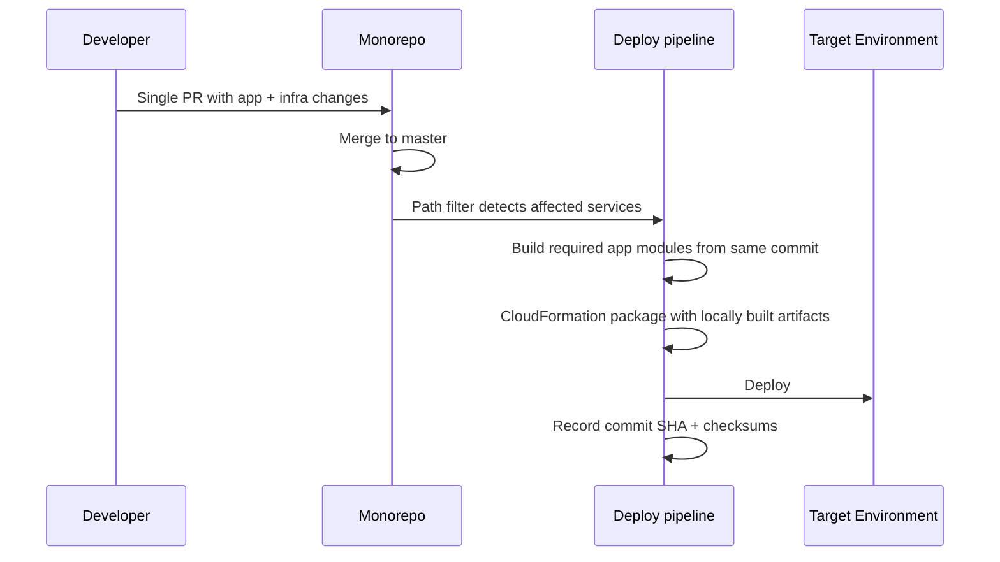

#### What changes are needed

**Repository:**
- Full merge of all four repositories into one (largest migration step)
- Freeze/archive original repositories
- Add path-based review policies

**CI/CD:**
- Complete rewrite of all pipeline triggers with path-filtered monorepo workflows
- Build impacted service artifacts from source in the same pipeline execution
- Strict path filtering and caching to control cost/runtime

**Artifact handling:**
- Rewrite service buildspecs to use local source builds instead of Artifactory resolution
- Keep optional caching only for third-party dependencies

**Cleanup:**
- Remove all version sync workflows and scripts
- Remove snapshot publication paths
- Remove deployment-critical Artifactory coupling for internal artifacts

**Files primarily affected:**
- `.github/workflows/*.yml` (complete rewrite)
- `*/build/buildspec.yaml` (rewrite for local source builds)
- `*/build/config/settings.xml` (remove internal artifact repos)
- `*/artefacts/pom.xml` (simplify or remove version properties)
- `*/deploy/templates/**/*.yaml` (pipeline source and trigger updates)

#### Trade-offs

| Dimension | Assessment |
| :--- | :--- |
| Atomicity | Maximum - app and infra in one commit, no version handoff needed |
| Migration effort | Very high - requires repository consolidation, complete CI/CD rewrite with path filtering, branch protection redesign, buildspec rewrites for local source builds, and team process changes, all before any value is delivered |
| Rollback | Redeploy previous commit SHA (requires rebuild) |
| Blast-radius control | Medium - one commit moves everything, service scope via path filters |
| Parallel development | Good within monorepo, but longer deploy-time builds |
| Reversibility | Costly - reverting monorepo migration is disruptive |

#### Development workflow

Developer creates branch in monorepo with app+infra changes together. Developer triggers dev deployment from branch — pipeline builds app modules from branch source and deploys alongside infra changes.

#### Residual limitations

- Dev deployments are slower due to build step at deploy time.
- Requires full monorepo migration before any value is delivered.
- Path-filter complexity can cause unexpected or missed build triggers during development.

---

### Approach 8: Plain Monorepo + Artifact Id Deployment Parameter

**What it is:** All repos merged into one monorepo. App artifacts are still published to Artifactory on merge. Deployment pipelines receive explicit Artifact Id inputs at runtime - the same parameter model as Approach 5, but within a single repository. No hash references in infra POM files, no post-merge mutation.

**Why it avoids the hash timing problem:** Because infra files no longer store version references at all. The monorepo commit is atomic for review, and deployment version selection happens at pipeline runtime via Artifact Id parameters. The timing paradox from Section 6 disappears - there is nothing to patch after merge.

#### Interaction diagram

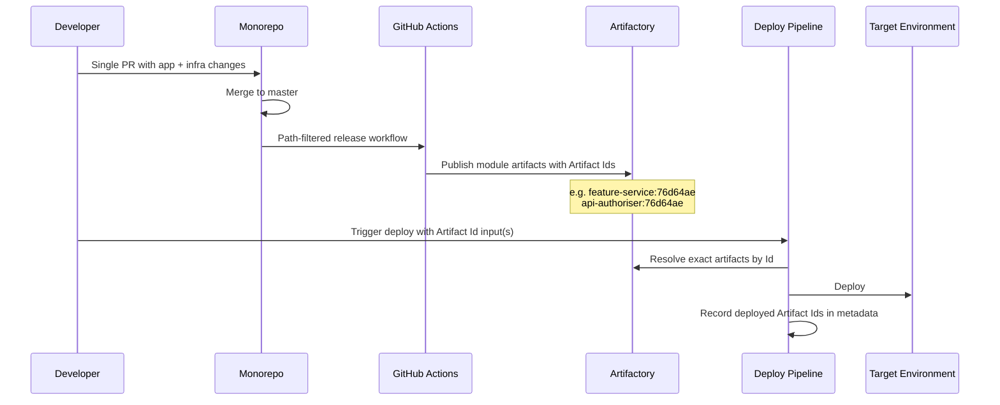

#### What changes are needed

**Repository:**
- Full merge of all four repositories into one
- Freeze/archive original repositories
- Add path-based review policies

**CI/CD:**
- Rewrite pipeline triggers with path-filtered monorepo workflows
- App release workflows publish artifacts to Artifactory as today, but triggered by monorepo path filters
- Deployment workflows accept Artifact Id parameters (same contract as Approach 5)

**Infra buildspecs** (`*/build/buildspec.yaml`):
- Replace POM version resolution with parameter-driven artifact resolution from Artifactory
- Keep `stripVersion=true` so downstream IaC paths remain stable

**Deployment templates** (`*/deploy/templates/**/*.yaml`):
- Add parameter definitions for Artifact Id inputs in pipeline CloudFormation templates
- Pass parameters through pipeline stages to CodeBuild actions

**Cleanup:**
- Remove version properties from infra artefacts POMs (no longer needed)

**Files primarily affected:**
- `.github/workflows/*.yml` (rewrite with path filters + Artifact Id parameter support)
- `*/build/buildspec.yaml` (parameterize artifact resolution)
- `*/artefacts/pom.xml` (remove version properties)
- `*/deploy/templates/**/*.yaml` (pipeline parameter plumbing)

#### Trade-offs

| Dimension | Assessment |
| :--- | :--- |
| Atomicity | Maxiumum - single PR for app + infra review; deployment intent is explicit via Artifact Id |
| Migration effort | High - repository consolidation + CI/CD rewrite, but no post-merge mutation logic needed |
| Rollback | Strong - redeploy previous known-good Artifact Id set |
| Blast-radius control | Strong with per-module inputs; medium if using single global SHA |
| Parallel development | Good - PRs are independent within monorepo; deployments select their own inputs |
| Reversibility | Costly for repo structure - splitting repos back is disruptive; versioning model itself is reversible |

#### Development workflow

Developer creates branch in monorepo with app+infra changes. Manual or branch CI publishes SNAPSHOT to Artifactory from the branch. Developer triggers dev deployment with the SNAPSHOT Artifact Id. App+infra changes are tested together from one branch.

#### Residual limitations

- Requires full monorepo migration before any benefit is realized.
- Path-filter CI/CD complexity must be built and validated upfront.
- Splitting repos back is disruptive if the approach doesn't work out.

---

### Approach 9: Plain Monorepo + Inverted Dependency Manifest

**What it is:** All repos merged into one. App release workflows publish both artifacts and an immutable deployment manifest bundle to Artifactory. Infra pipelines discover and consume that manifest at deploy time. No hash references in infra POM files, no post-merge mutation, no build-at-deploy-time overhead. Deployment to dev can be auto-dispatched by the release workflow with the new manifest ID. Production deployment remains a manual trigger with the manifest ID as input to preserve approval gate.

**Why it avoids the hash timing problem:** Infra files no longer store version references at all. The monorepo commit is atomic for review, and the manifest published after release carries the full deployment contract (artifact coordinates, checksums, template references). The timing paradox from Section 6 disappears - infra pipelines resolve deployment intent from the manifest, not from committed file contents.

**Why it is attractive:** Combines the strongest review-level atomicity of a monorepo (one PR for app + infra) with the strongest app-to-deploy contract (immutable manifest bundle). Rollback is clean - redeploy a previous manifest. No version-sync churn, no post-merge patching, no build-at-deploy slowness.

#### Interaction diagram

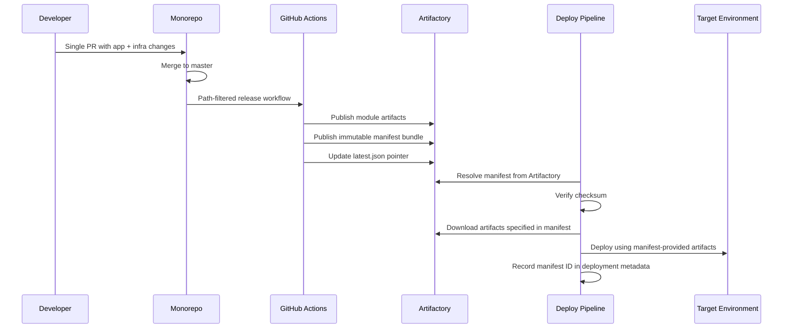

#### What changes are needed

**Repository:**
- Full merge of all four repositories into one
- Freeze/archive original repositories
- Add path-based review policies (CODEOWNERS)

**CI/CD:**
- Rewrite pipeline triggers with path-filtered monorepo workflows
- App release workflows publish artifacts + immutable manifest bundle to Artifactory
- Define manifest schema: service, environment, source branch/commit, artifact coordinates, checksums, timestamp
- Add branch-pointer updates (`latest.json`) for development workflows

**Infra pipelines** (`*/build/buildspec.yaml`):
- Replace Maven-based artifact resolution with manifest-driven artifact download
- Add resolve-manifest stage: discover manifest from Artifactory, verify checksum, download specified artifacts
- Keep `stripVersion=true` so downstream IaC paths remain stable

**Deployment templates** (`*/deploy/templates/**/*.yaml`):
- Pipeline stages consume manifest-provided template and parameter values
- Add checksum verification gates before deploy

**Operational:**
- Define Artifactory pathing and retention policy for manifests
- Define rollback playbook based on manifest version pinning
- Build local override mechanism for development manifest resolution

**Cleanup:**
- Remove version properties from infra artefacts POMs
- Remove cross-repo version sync workflows and scripts
- Deprecate snapshot publication paths for deployment-critical flows

**Files primarily affected:**
- `.github/workflows/*.yml` (complete rewrite with path filters + manifest publication)
- `.github/scripts/java-release.sh` (add manifest generation step)
- `*/build/buildspec.yaml` (replace artifact resolution with manifest consumption)
- `*/artefacts/pom.xml` (remove version properties)
- `*/deploy/templates/**/*.yaml` (pipeline source and trigger updates)
- New: manifest schema definition and discovery logic

#### Trade-offs

| Dimension | Assessment |
| :--- | :--- |
| Atomicity | Maximum - single PR for app + infra review; manifest carries full deployment contract as one immutable bundle |
| Migration effort | High - repository consolidation + CI/CD rewrite + manifest schema design and publication logic |
| Rollback | Strong - redeploy any previous immutable manifest bundle |
| Blast-radius control | Strong - manifest contains per-module versions |
| Parallel development | Good - independent manifests per release; no interference between parallel PRs |
| Reversibility | Costly for repo structure - splitting repos back is disruptive; manifest model itself can be retired |

#### Development workflow

Developer creates branch in monorepo with app+infra changes. Manual or branch CI publishes a development manifest with SNAPSHOT artifacts. Dev deployment resolves the branch manifest automatically. App+infra changes are tested together from one branch.

#### Residual limitations

- Most complex implementation — requires monorepo migration + manifest schema + publication logic + consumption logic before first value is delivered.
- Manifest discovery adds a layer of indirection that must be well-documented and understood by the whole team.
- Splitting repos back is disruptive if the approach doesn't work out.

---

## 8. Comparison Matrix

### At a glance

| Approach | Atomicity | Migration Effort | Rollback Quality | Blast-Radius Control |
| :--- | :--- | :--- | :--- | :--- |
| Separated + Hash (current) | Low - app and infra changes are separate PRs | None - already running | Moderate - requires POM rollback across repos + coordinated redeploy | Strong - per-module version properties |
| Monorepo + Hash | Medium-high - PR is atomic, but hash reference requires post-merge mutation | Very high - repo merge, full CI/CD rewrite, process change | Weak - hash mutation history makes it hard to identify clean rollback point | Strong - per-module properties remain |
| Subtree + Hash | Medium-high - atomic PR review, but subtree sync and hash timing add compounding complexity | High - custom tooling, ongoing subtree maintenance | Weak - requires mapping between monorepo and subtree repo commits | Strong - per-module properties remain |
| Separated + Manifest | Medium - manifest carries app + deployment intent together, but the other changes (ex. object service creation) require multiple PRs | Medium-high - manifest schema, publication logic, consumption rewrite | Strong - redeploy any previous immutable manifest bundle | Strong - manifest contains per-module versions |
| Separated + Artifact Id | Medium - app + deploy intent linked through explicit Artifact Id, but the other changes (ex. object service creation) require multiple PRs | Low-medium - add parameters to existing pipelines, no repo restructuring | Strong - redeploy any previous known-good Artifact Id set | Strong with per-module inputs |
| Separated + Build on Demand | Medium - deploy tied to explicit source SHA, but the other changes (ex. object service creation) require multiple PRs | Medium - buildspec rewrites, toolchain parity, reproducibility controls | Good - redeploy old SHA, but requires rebuild | Medium - SHA is global unless module-level build scope is defined |
| Monorepo + Build on Demand | Maximum - app and infra in one commit, no version handoff needed | Very high - repo merge + CI/CD rewrite + buildspec rewrite, all required upfront | Good - redeploy previous commit, but requires rebuild | Medium - one commit moves everything |
| Monorepo + Artifact Id | Maximum - single PR for app + infra review; deployment intent is explicit via Artifact Id | High - repo merge + CI/CD rewrite, but no post-merge mutation needed | Strong - redeploy any previous known-good Artifact Id set | Strong with per-module inputs |
| Monorepo + Manifest | Maximum - single PR for app + infra review; manifest carries full deployment contract as one immutable bundle | High - repo merge + CI/CD rewrite + manifest schema design and publication logic | Strong - redeploy any previous immutable manifest bundle | Strong - manifest contains per-module versions |

### Operational characteristics

| Approach | Coexists with Current? | Hotfix Speed | Blue/Green Compatible? | Reversible? |
| :--- | :--- | :--- | :--- | :--- |
| Separated + Hash | Is current | Slow - requires multi-repo PRs and sync | Yes | Is current |
| Monorepo + Hash | Staged only - dual operation during migration | Medium - single-repo edit, but hash timing adds steps | Needs pipeline redesign | Costly - repository split-back is disruptive |
| Subtree + Hash | Fragile - breaks if anyone pushes to subtree repo directly | Slow - subtree sync ordering adds delays | Needs pipeline redesign | Complex - subtree history unwind |
| Separated + Manifest | Yes, per-service - migrate one service at a time | Fast - publish patched manifest, redeploy | Yes | Good - retire manifest path, revert to hash sync |
| Separated + Artifact Id | Yes, per-service - existing hash-sync stays as fallback | Fast - publish patch, deploy with new Id | Yes | High - disable parameter mode, fall back |
| Separated + Build on Demand | Yes, per-service - pilot with fallback | Fast in control flow, speed depends on build time | Yes | Good - re-enable Artifactory resolution |
| Monorepo + Build on Demand | Staged only - dual operation during migration | Fast in control flow, speed depends on build time | Needs pipeline redesign | Costly - repository split-back is disruptive |
| Monorepo + Artifact Id | Staged only - dual operation during migration | Fast - publish patch, deploy with new Id | Needs pipeline redesign | Costly for repo structure; versioning model is reversible |
| Monorepo + Manifest | Staged only - dual operation during migration | Fast - publish patched manifest, redeploy | Needs pipeline redesign | Costly for repo structure; manifest model itself can be retired |

---

## 9. Key Questions Answered

### Q1. Can the approach coexist with the current model during migration?

- **Separated + Hash, Separated + Manifest, Separated + Artifact Id, Separated + Build on Demand:** Yes. Can be adopted incrementally, service-by-service, with the current model as fallback.
- **Monorepo + Hash, Monorepo + Build on Demand, Monorepo + Artifact Id, Monorepo + Manifest:** Only during a staged migration period with dual operational overhead.
- **Subtree + Hash:** Fragile coexistence - breaks if branch discipline is inconsistent.

### Q2. How do we identify which app version is deployed in each environment?

- **Separated + Hash:** Cross-reference infra POM properties + pipeline history.
- **Monorepo + Hash, Subtree + Hash:** Track monorepo commit + any post-merge patches - less straightforward.
- **Separated + Manifest, Monorepo + Manifest:** Read deployed manifest contract.
- **Separated + Artifact Id, Separated + Build on Demand, Monorepo + Artifact Id:** Read deployment input parameters from pipeline execution metadata.
- **Monorepo + Build on Demand:** Monorepo commit SHA is the single version identifier.

### Q3. What is the hotfix workflow?

- **Separated + Hash:** App hotfix release + infra POM updates + coordinated multi-repo PRs. Slowest.
- **Monorepo + Hash, Subtree + Hash:** Single-repo hotfix edit, but hash timing and sync add complexity.
- **Separated + Manifest, Monorepo + Manifest:** Publish patched artifact + manifest, redeploy. Fast.
- **Separated + Artifact Id, Monorepo + Artifact Id:** Publish patched artifact, deploy with new Artifact Id. Fastest.
- **Separated + Build on Demand, Monorepo + Build on Demand:** Deploy hotfix SHA - fast in control flow, speed depends on build duration.

### Q4. How does parallel development behave?

- **Separated + Hash:** Parallel PRs create cross-repo sync pressure.
- **Monorepo + Hash, Subtree + Hash:** PR review is parallel, but release/reference sequencing serializes merges.
- **Separated + Manifest, Separated + Artifact Id, Monorepo + Artifact Id, Monorepo + Manifest:** Independent manifests or Artifact Ids per release - no interference.
- **Separated + Build on Demand, Monorepo + Build on Demand:** Independent at source level, but build-at-deploy can queue.

### Q5. How simple and safe is rollback?

- **Separated + Hash:** Requires infra POM rollback + coordinated redeploy.
- **Monorepo + Hash, Subtree + Hash:** Complicated by reference mutation and subtree lineage.
- **Separated + Artifact Id, Monorepo + Artifact Id:** Redeploy previous Artifact Id set.
- **Separated + Manifest, Monorepo + Manifest:** Redeploy previous manifest bundle.
- **Separated + Build on Demand, Monorepo + Build on Demand:** Redeploy old SHA (requires rebuild, depends on reproducibility).

### Q6. What team behavior changes are required?

- **Separated + Hash:** Developers must maintain discipline around cross-repo branch creation, POM version updates, and PR coordination timing. The main habit is remembering to sync infra repos after every app change - and doing so correctly when multiple people merge in parallel.
- **Monorepo + Hash:** Team must adopt monorepo-wide ownership awareness. Developers need to understand path-based CI triggers, and the post-merge hash patching step. The main new discipline is trusting and verifying the automated post-merge mutation.
- **Subtree + Hash:** Highest process discipline. All PRs must go through the monorepo - never directly to subtree repos. Developers must learn subtree-specific commands and understand the ordering between subtree sync, release, and hash injection. Mistakes are expensive to detect and repair.
- **Separated + Manifest:** App developers take on responsibility for manifest content and correctness alongside code changes. Infra team shifts from managing version references to managing manifest consumption and platform baseline. Both teams need to understand the manifest schema and discovery contract.
- **Separated + Artifact Id:** Developers must adopt the habit of providing explicit Artifact Id inputs when triggering deployments, instead of relying on whatever version is committed in infra POM files. Teams need discipline around recording and communicating which Artifact Ids are deployed where. The change is small in scope but requires consistent adoption.
- **Separated + Build on Demand:** Team must accept that deployment includes a build step, making deploys slower. Developers need confidence in build reproducibility - understanding that deploying an old SHA will rebuild from that source and produce equivalent artifacts. Toolchain version pinning becomes a shared responsibility.
- **Monorepo + Build on Demand:** Combines monorepo ownership discipline with build-at-deploy acceptance. Developers must understand path-filtered CI and that each deploy rebuilds from source. The broadest behavior change of all approaches.
- **Monorepo + Artifact Id:** Developers work in a single repo but deployment workflow stays familiar - trigger with Artifact Id inputs. The main new habit is monorepo-aware PR and review practices; deployment discipline is the same as Separated + Artifact Id.
- **Monorepo + Manifest:** Developers work in a single repo and take on responsibility for manifest content alongside code changes. The main new habits are monorepo-aware PR practices and understanding the manifest schema and discovery contract.

### Q7. Does it work with blue/green deployment stacks?

All approaches are compatible. Monorepo variants (Monorepo + Hash, Subtree + Hash, Monorepo + Build on Demand, Monorepo + Artifact Id, Monorepo + Manifest) require pipeline redesign for blue/green orchestration. Separated-repo approaches work with existing blue/green patterns.

### Q8. Is the approach reversible?

- **Separated + Hash, Separated + Artifact Id, Separated + Build on Demand:** Highly reversible - disable new path, fall back to current model.
- **Separated + Manifest:** Reversible by retiring manifest consumption.
- **Monorepo + Hash, Monorepo + Build on Demand, Monorepo + Artifact Id, Monorepo + Manifest:** Reversible but costly - separating repository history split will require custom logic.
- **Subtree + Hash:** Reversible - subtree repositories contain own history.

---

## 10. Recommendation

### Fastest recommendation: Separated Repos + Artifact Id Deployment Parameter (Approach 5)

This is the most straightforward path given current system behavior and confidence needs.

**Why:**

1. **Lowest complexity** for meaningful improvement - no repository restructuring required.
2. **Best confidence profile** - explicit deployment inputs are easy to reason about and audit.
3. **Strongest blast-radius control** - per-module Artifact Id inputs preserve current granularity.
4. **Fastest hotfix and rollback** - redeploy any known-good Artifact Id set without file mutation.
5. **Highest reversibility** - can fall back to current hash-sync model at any time.
6. **Supports development workflow** - non-master branch artifacts work for local/dev infra deployments.

**Important constraint:** Use module-level Artifact Id inputs (not a single global SHA) to preserve blast-radius control.

### Ultimate recommendation:  Monorepo + Dependency Manifest (Approach 9)

This is the most practical long-term target. It combines the strongest review-level atomicity (one PR for app + infra) with the strongest deployment contract (immutable manifest bundle). It provides clean rollback, and supports per-module blast-radius control through manifest contents.

**Why this is the end state:**

1. **Maximum atomicity** - one PR contains app code, infra templates, and deployment intent together. No coordination across repos, no version sync, no timing paradox.
2. **Strongest deployment contract** - an immutable manifest bundle carries exact artifact coordinates, checksums, and template references. There is no ambiguity about what is being deployed.
3. **Clean rollback** - redeploy any previous manifest bundle. No need to rebuild, no need to trace back through POM history or pipeline metadata.
4. **Per-module blast-radius control** - manifest contains individual module versions, so one module can advance without forcing others.
5. **Eliminates all version-sync churn** - no hash updates in POM files, no sync scripts, no post-merge mutation.

**Why Artifact Id parameters are a valuable intermediary step (not a wasted step):**

Going directly from the current hash-reference model to Monorepo + Manifest would require solving too many problems simultaneously: repository consolidation, CI/CD rewrite with path filters, manifest schema design, manifest publication logic, manifest consumption in pipelines, and local development override behavior - all before any value is delivered.

The Artifact Id parameter phase (Phase 1 and Phase 2) delivers immediate value and builds the foundation that the manifest phase depends on:

1. **Decouples version selection from committed files** - the core mental model shift (version is a deployment-time input, not a committed reference) is identical in both Artifact Id and manifest approaches. Teams learn this habit once and carry it forward.
2. **Builds pipeline parameter plumbing** - the CloudFormation parameter definitions, CodeBuild environment variable wiring, and metadata recording infrastructure created for Artifact Id inputs are directly reused when manifest consumption is added. The manifest resolver simply becomes the source of those same parameter values.
3. **Proves the operational model** - hotfix, rollback, parallel development, and blue/green workflows are validated with Artifact Id parameters before adding manifest complexity on top. If any operational issue surfaces, it is easier to diagnose without manifest discovery logic in the picture.
4. **Enables incremental monorepo migration** - Phase 2 (Monorepo + Artifact Id) validates that path-filtered CI/CD and monorepo PR workflow function correctly with a proven versioning model. Manifest introduction in Phase 3 then only changes how artifact coordinates are discovered, not how they flow through pipelines.
5. **Preserves reversibility at each step** - if Phase 3 encounters problems, the team can stay on Monorepo + Artifact Id indefinitely. It is already a strong operating model. The manifest layer is an enhancement, not a requirement.

In short: Artifact Id parameters are not throwaway work. They are the pipeline and operational foundation that manifest consumption plugs into. Skipping this step means building and validating manifest logic on top of untested pipeline plumbing, inside an untested monorepo structure, with an untested operational model - all at once.

### Long-term evolution path

The recommended progression is:

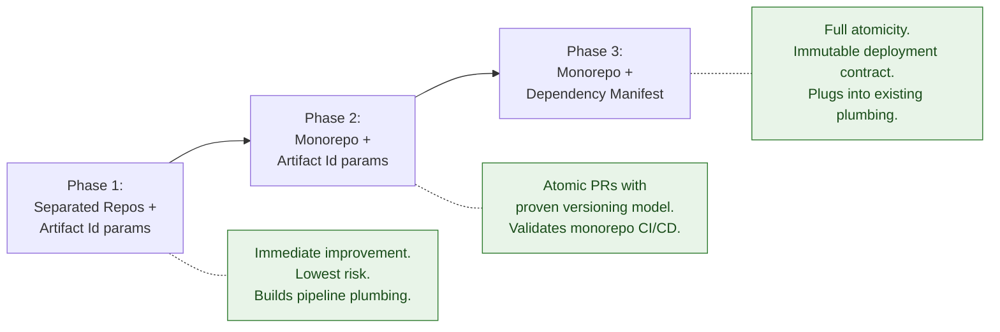

**What carries forward between phases:**

| Built in Phase | Reused in Next Phase |
| :--- | :--- |
| Phase 1: Pipeline parameter definitions, CodeBuild wiring, metadata recording | Phase 2 reuses all parameter plumbing in monorepo pipelines |
| Phase 2: Path-filtered CI/CD, monorepo PR workflow, release path filters | Phase 3 adds manifest publication to existing release workflows |
| Phase 2: Artifact Id deployment operational model (hotfix, rollback, blue/green) | Phase 3 keeps same operational model; manifest resolver replaces manual Artifact Id input |

**What changes between phases:**

| Phase transition | What is added | What is retired |
| :--- | :--- | :--- |
| Current → Phase 1 | Artifact Id parameters, metadata recording | Hash-sync scripts (deprecated gradually) |
| Phase 1 → Phase 2 | Monorepo structure, path-filtered workflows | Multi-repo PR coordination, cross-repo linking |
| Phase 2 → Phase 3 | Manifest schema, publication, discovery, consumption | Manual Artifact Id input selection (automated by manifest) |

---

## 11. Immediate Actions without changes to architecture

### 1) POM sync script

The existing sync script (`app/java/applications/pom-version-sync/sync-module-versions.sh`) resolves the latest commit hash from a specified branch, removing manual lookup. It automates manual work done now.

This fits the current flow and will be deprecated as services migrate to Artifact Id parameters.

### 2) Add cross-repo PR linking automation

Create a lightweight script/GitHub Action that:

1. Parses ticket id from PR title or branch name.
2. Searches matching open PRs across app and infra repositories.
3. Posts/updates a comment block with associated PR links.

This gives immediate coordination gains without committing to any structural change.

### 3) Pilot Artifact Id deployment for one service

Pick one service (e.g. feature-service) and implement the full Artifact Id deployment parameter flow end-to-end.

---

## 12. Suggested Tickets Plan

### Phase 1: Separated Repos + Artifact Id

| # | Ticket |
| :--- | :--- |
| 1 | Define Artifact Id parameter contract (naming, format, per-module granularity) |
| 2 | Add Artifact Id parameters to feature-service pipeline and deployment |
| 3 | Add deployment metadata recording (stack tags/SSM) |
| 4 | Pilot feature-service end-to-end |
| 5 | Extend Artifact Id parameter to object-service and buckets |
| 6 | Deprecate hash-sync workflow for migrated services |

### Phase 2: Monorepo consolidation

| # | Ticket |
| :--- | :--- |
| 8 | Merge repositories into monorepo |
| 9 | Rewrite CI/CD with path-filtered workflows |
| 10 | Validate Artifact Id deployment flow in monorepo |

### Phase 3: Monorepo + Deployment Manifest

| # | Ticket |
| :--- | :--- |
| 11 | Design manifest schema |
| 12 | Implement manifest generation and publication in release workflow |
| 13 | Add manifest discovery and consumption in deploy pipelines |
| 14 | Add local development manifest override mechanism |
| 15 | Define Artifactory retention policy for manifests |
| 16 | Migrate services to manifest-driven deployment |